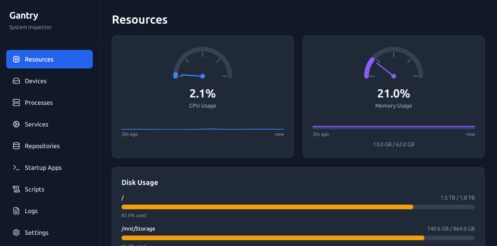
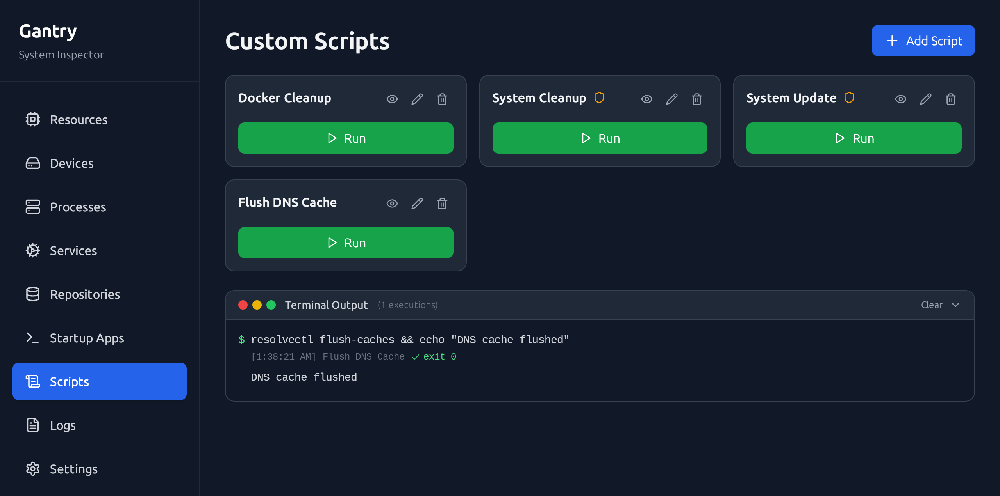

# Gantry

A lightweight Linux system management desktop app built with Tauri and React. Monitor your machine, manage services, control packages, and run scripts — all from one clean interface.

## Screenshots





## Features

**Resources** — Live CPU, memory, GPU, disk, and network monitoring with historical sparkline graphs. Per-core breakdown, thermal sensors grouped by device (CPU, GPU, NVMe, DIMM, network adapter), fan speeds, load average, and uptime.

**Processes** — Grouped process list with CPU/memory usage. Kill individual processes or entire groups. Live auto-refresh mode, sortable columns, and search by name or PID.

**Services** — Browse and manage systemd services (user + system). Start, stop, restart, enable, and disable with live status indicators.

**Devices** — Hardware overview: block devices, PCI, USB, network interfaces, input devices, and processor info. OS/kernel info card at the top. Click any value to copy it.

**APT Repositories** — View, add, enable/disable, and delete APT sources. Supports both `.list` and DEB822 `.sources` formats.

**Startup Apps** — Full CRUD for XDG autostart entries. Add, edit, toggle, and delete `~/.config/autostart` desktop files.

**Scripts** — Create and run custom shell scripts with optional sudo. Output displayed inline.

**System Report** — One-click hardware summary (OS, CPU, RAM, GPU, storage) formatted for pasting into support tickets or GitHub issues.

## Installation

### Prerequisites

- Node.js 18+
- Rust 1.77+
- [Tauri system dependencies](https://tauri.app/start/prerequisites/)

### Build from Source

```bash
git clone https://github.com/Cedric-Lefebvre/gantry.git
cd gantry
npm install
npm run tauri dev     # development
npm run tauri build   # production
```

Built packages are output to `src-tauri/target/release/bundle/` as `.deb`, `.rpm`, and `.AppImage`.

## Configuration

```
~/.gantry/
├── scripts.yaml    # custom scripts
└── settings.yaml   # theme and preferences
```

## Tech Stack

- **Frontend**: React 18, TypeScript, Tailwind CSS
- **Backend**: Rust, Tauri 2.0

## License

MIT
