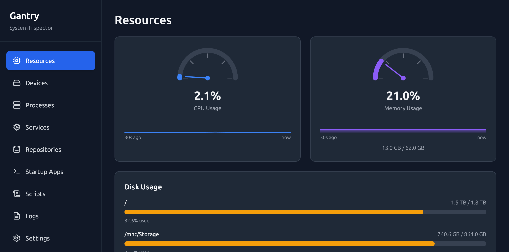
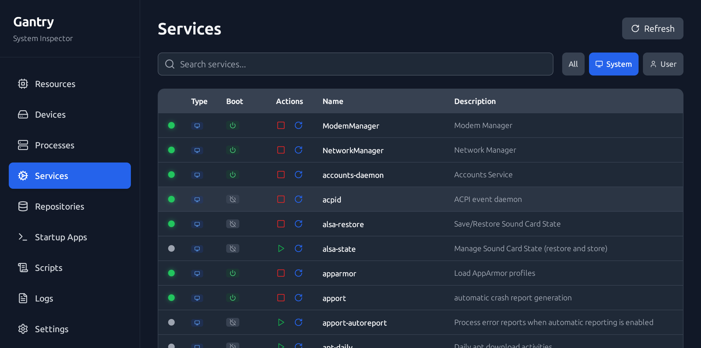
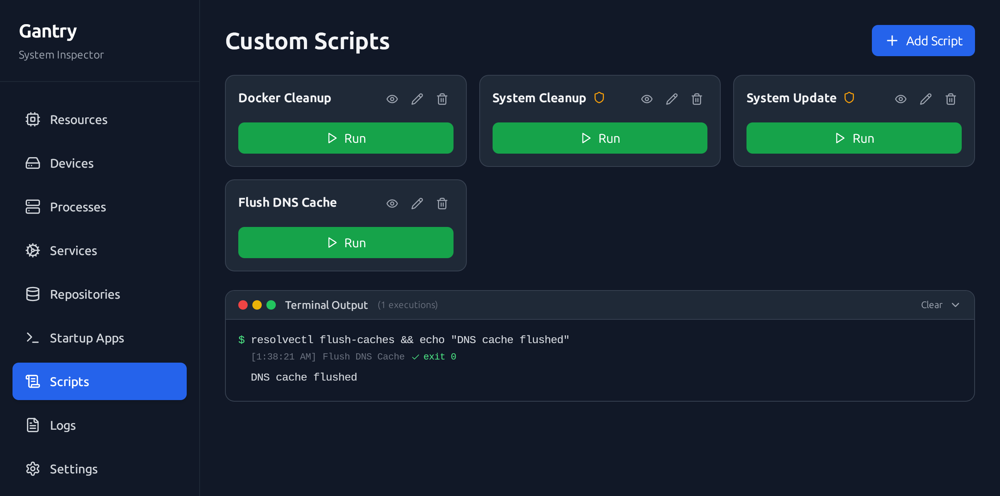

# Gantry

A lightweight system management desktop app built with Tauri and React. Monitor your machine, manage services, control packages, and run scripts — all from one clean interface. Runs on **Linux** and **macOS**: where Linux uses systemd and APT, macOS uses launchd and Homebrew, and the UI adapts automatically.

## Screenshots





## Features

**Resources** — Live CPU, memory, GPU, disk, and network monitoring with historical sparkline graphs. Per-core breakdown, thermal sensors grouped by device (CPU, GPU, NVMe, DIMM, network adapter), fan speeds, load average, and uptime.

**Processes** — Grouped process list with CPU/memory usage. Kill individual processes or entire groups. Live auto-refresh mode, sortable columns, and search by name or PID.

**Services** — Browse and manage systemd services (user + system). Start, stop, restart, enable, and disable with live status indicators.

**Devices** — Hardware overview: block devices, PCI, USB, network interfaces, input devices, and processor info. OS/kernel info card at the top. Click any value to copy it.

**APT Repositories** — View, add, enable/disable, and delete APT sources. Supports both `.list` and DEB822 `.sources` formats.

**Startup Apps** — Full CRUD for XDG autostart entries. Add, edit, toggle, and delete `~/.config/autostart` desktop files.

**Scripts** — Create and run custom shell scripts with optional sudo. Output displayed inline.

**System Report** — One-click hardware summary (OS, CPU, RAM, GPU, storage) formatted for pasting into support tickets or GitHub issues.

## Installation

### APT (Ubuntu / Debian)

```bash
curl -fsSL "https://packages.buildkite.com/cedric-lefebvre/ppa/gpgkey" \
  | sudo gpg --dearmor -o /etc/apt/keyrings/cedric-lefebvre_ppa-archive-keyring.gpg

echo -e "deb [signed-by=/etc/apt/keyrings/cedric-lefebvre_ppa-archive-keyring.gpg] https://packages.buildkite.com/cedric-lefebvre/ppa/any/ any main\ndeb-src [signed-by=/etc/apt/keyrings/cedric-lefebvre_ppa-archive-keyring.gpg] https://packages.buildkite.com/cedric-lefebvre/ppa/any/ any main" \
  | sudo tee /etc/apt/sources.list.d/buildkite-cedric-lefebvre-ppa.list

sudo apt update && sudo apt install gantry
```

Once set up, `sudo apt upgrade` will keep Gantry up to date automatically.

### Manual Download

Download the latest `.deb`, `.rpm`, or `.AppImage` from the [releases page](https://github.com/Cedric-Lefebvre/gantry/releases).

### macOS

Download the latest `.dmg` from the [releases page](https://github.com/Cedric-Lefebvre/gantry/releases) — pick `aarch64` for Apple Silicon or `x64` for Intel — open it, and drag **Gantry** into `Applications`.

Because the app is not yet signed with an Apple Developer ID, Gatekeeper will block it on first launch ("Gantry can't be opened because Apple cannot check it for malicious software"). Clear the download quarantine flag once:

```bash
xattr -dr com.apple.quarantine /Applications/Gantry.app
```

Alternatively, right-click the app in Finder and choose **Open**, then confirm in the dialog.

> **Note:** On macOS, the package and service features map to the platform's native tooling — *Repositories* manages Homebrew taps (requires [Homebrew](https://brew.sh)) and *Services* / *Startup Apps* manage launchd agents and daemons. Privileged scripts and service actions prompt for credentials via the standard macOS admin dialog.

### CLI

```bash
gantry            # launch the app
gantry --version  # print version
gantry --help     # print help
```

### Build from Source

- Node.js 18+
- Rust 1.77+
- [Tauri system dependencies](https://tauri.app/start/prerequisites/) (on macOS: Xcode Command Line Tools — `xcode-select --install`)

```bash
git clone https://github.com/Cedric-Lefebvre/gantry.git
cd gantry
npm install
npm run tauri dev     # development
npm run tauri build   # production
```

## Testing

Gantry has an end-to-end test suite that drives the real app via WebdriverIO + tauri-driver.

### Prerequisites (one-time)

```bash
# Tauri's WebDriver wrapper
cargo install tauri-driver

# WebKitWebDriver (webkit2gtk)
sudo apt install webkit2gtk-driver   # Ubuntu 22.04
# or
sudo apt install webkitgtk-6.0-injected-bundle  # Ubuntu 24.04+

# Build the release binary first (tests run against the real binary)
npm run tauri:build
```

### Run

```bash
npm run test:e2e
```

`wdio.conf.cjs` automatically starts `tauri-driver`, launches the app, runs all 6 spec files sequentially, and tears everything down. A display is required (Xorg or Wayland with XWayland).

### Specs

| File | What it covers |
|------|---------------|
| `01-navigation` | Sidebar links, active highlight |
| `02-resources` | CPU / memory / disk widgets load |
| `03-processes` | Process list, search, refresh |
| `04-devices` | Hardware cards, collapse/expand |
| `05-services` | Service list, search, tabs |
| `06-scripts` | Full CRUD: add → run → delete, prompt variables |

## Configuration

```
~/.gantry/
├── scripts.yaml    # custom scripts
└── settings.yaml   # theme and preferences
```

## Tech Stack

- **Frontend**: React 18, TypeScript, Tailwind CSS
- **Backend**: Rust, Tauri 2.0

## License

MIT
